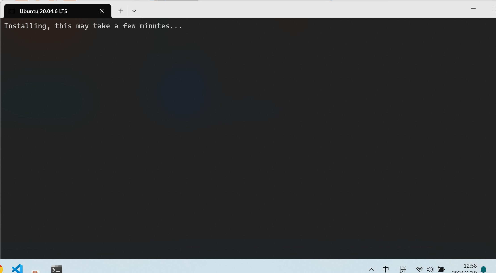

## 配置wsl
---
### 1.1 wsl是什么
wsl是适用于Windows系统的Linux虚拟机。可以让你在Windows上面拥有Linux环境。

###  2.1 安装wsl

#### 打开wsl功能
“控制面板” > “程序” > “程序和功能” > “启用或关闭Windows功能” > “重启电脑”

#### 安装Linux发行版
“Microsoft Store” > “搜索wsl” > “选择Ubuntu 20.04.6 LTS” > “点击安装”

#### 进入系统
安装完成后，点击打开，将会弹出终端:

等待安装，这通常会花费几分钟时间，如果卡在这个界面可以尝试魔法。

安装完成之后，将会显示:
```
Enter new UNIX username:
```
此时，你需要输入你的Linux用户名称。不过需要注意的是，这个名称可能会有限制。建议名称为小写字符加上'_'。例如'li_user'。

点击回车后，等待几秒钟，将会弹出设置密码的提示:
```
New password:
```
密码建议简单一些，例如'123456'。因为后续的管理员操作都需要输入密码，如果设置的太复杂会很麻烦。

重新输入密码:
```
Retype new password:
```
重新输入之前设置的密码。

随后如果返回:
```
Welcome to Ubuntu 20.04.6 LTS (GNU/Linux 5.15.146.1-microsoft-standard-WSL2 x86_64)

 * Documentation:  https://help.ubuntu.com
 * Management:     https://landscape.canonical.com
 * Support:        https://ubuntu.com/advantage

  System information as of Tue Apr 30 13:11:29 CST 2024

  System load:  0.49                Processes:             68
  Usage of /:   0.1% of 1006.85GB   Users logged in:       0
  Memory usage: 7%                  IPv4 address for eth0: 172.27.107.208
  Swap usage:   0%


Expanded Security Maintenance for Applications is not enabled.

0 updates can be applied immediately.

Enable ESM Apps to receive additional future security updates.
See https://ubuntu.com/esm or run: sudo pro status


The list of available updates is more than a week old.
To check for new updates run: sudo apt update


This message is shown once a day. To disable it please create the
/home/li_user/.hushlogin file.
```
证明用户注册完成，wsl已经可以正常使用了。
