## 从0到1将flet应用打包为apk
---
#### 前言
打包apk非常及其复杂，过程中会遇到各种各样的问题，这一篇教程也没办法涵盖所有的问题。但是实际上问题一般就分为以下几类:

1. 网络问题
2. 环境问题(依赖)
3. 环境变量
4. 版本问题
5. 磁盘空间不足

网络问题一般会卡在下载中，一般通过魔法解决，是最好解决的一类问题。  
环境问题通常是配置环境的时候，有没有配置完全的，通常需要根据报错或者提供的log来分析。  
环境变量没配置好，通常会导致指令运行过程当中，找不到相应的可执行文件，例如找不到编译器。  
版本问题通常是版本太新或者太久，导致不同板块之间版本不兼容
请确保安装wsl的磁盘预留出至少15G的空间。

总之是会出现各种各样的问题，不过万变不离其中。
在进行本教程之前，建议以下几点:

- 在bilibili看一下Linux常用命令。
- 了解环境变量是什么
- 了解Linux指令中的单引号和双引号的区别
- 了解`echo`，`export`，`sudo`，`rm`，`mkdir`，`unzip`，`tar` 等命令的使用。
  
这些准备工作大概需要花上一个小时的时间，但是却可以避免你后面操作的绝大多数的报错。

在本篇教程中，你在运行命令时，可能会遇到:
- Warning: 警告，通常不需要处理。但如果因次导致程序错误，则需要处理
- Error: 错误，这个报告必须要处理，否则无法往下运行。

处理错误请参考上面提到的对问题的处理。

### 1.0 步骤
##### Ⅰ. 配置wsl
##### Ⅱ. 配置环境
##### Ⅲ. 安装python
##### Ⅳ. 安装p4a及其依赖
##### Ⅴ. 创建python发行版
##### Ⅵ. 打包apk


### 1.1 配置wsl虚拟机
[配置Windows虚拟机](src/wsl环境配置.md)

### 1.2 配置网络环境
请遵守国家法律！
[配置网络环境](https://demo.hedgedoc.org/s/D4XaONupH)

### 1.3 进入虚拟机
按下win + x，点击'终端管理员'，选择'是'。
输入`wsl`,进入wsl系统。

### 1.4 配置flutter
[flutter中国官网](https://flutter.cn/docs/get-started/install/linux)，可以选择按照官网提供的方式二进行下载，或者选择看这里接下来的教程。

进入wsl虚拟机输入:
```bash
cd /$HOME/
```
导航到家目录。

创建一个目录:
```bash
mkdir ./Packaging
```
在家目录创建一个叫做Packaging的文件夹。

导航到Packaging目录下:
```bash
cd ./Packaging
```
现在你的工作目录为/$HOME/Packaging

**注意，在出现更换目录之前，所有操作的目录都在这个目录之下！也就是说，每次你关闭这个`powershell`终端窗口，重新进入wsl之后，都必须要导航到这个目录之下。除非你熟悉Linux，并且完全了解接下来的指令含义。**

下载flutter SDK:
```bash
wget https://storage.flutter-io.cn/flutter_infra_release/releases/stable/linux/flutter_linux_3.19.6-stable.tar.xz
```
等待下载完成...

下载完成后，将会显示如下文字:
```
--2024-04-30 14:01:31--  https://storage.flutter-io.cn/flutter_infra_release/releases/stable/linux/flutter_linux_3.19.6-stable.tar.xz
Resolving storage.flutter-io.cn (storage.flutter-io.cn)... 120.240.95.194
Connecting to storage.flutter-io.cn (storage.flutter-io.cn)|120.240.95.194|:443... connected.
HTTP request sent, awaiting response... 200 OK
Length: 667582424 (637M) [application/x-tar]
Saving to: ‘flutter_linux_3.19.6-stable.tar.xz’

flutter_linux_3.19.6-stable.t 100%[=================================================>] 636.66M  6.85MB/s    in 94s

2024-04-30 14:03:05 (6.75 MB/s) - ‘flutter_linux_3.19.6-stable.tar.xz’ saved [667582424/667582424]
```
找到最后一行的flutter_linux_3.19.6-stable.tar.xz文件名。你的文件名可能跟我的不一样，总之复制你下载的文件名称就行。

解压到家目录:
```bash
tar -xJvf flutter_linux_3.19.6-stable.tar.xz -C /$HOME/
```
注意将这个`flutter_linux_3.19.6-stable.tar.xz`替换为你下载的文件名。

解压之后，将flutter工具箱添加到环境变量首部分:

第一步，读取.bashrc文件:
```bash
nano ~/.bashrc
```
输入指令后将会显示这样的界面:
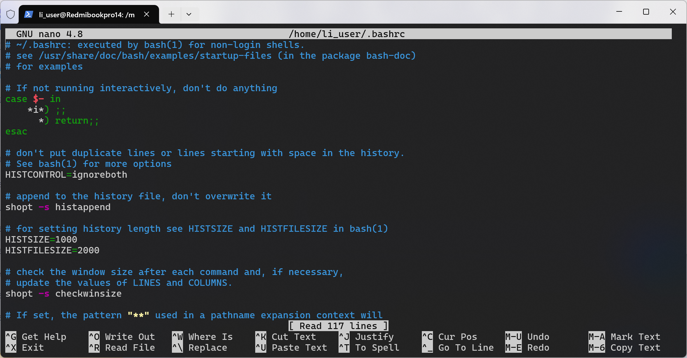

第二步，点击键盘↓操纵光标到文件末尾，然后将这个添加到文件末尾`export PATH="$HOME/flutter/bin:$PATH"`(直接复制粘贴即可)
看起来就像这样:
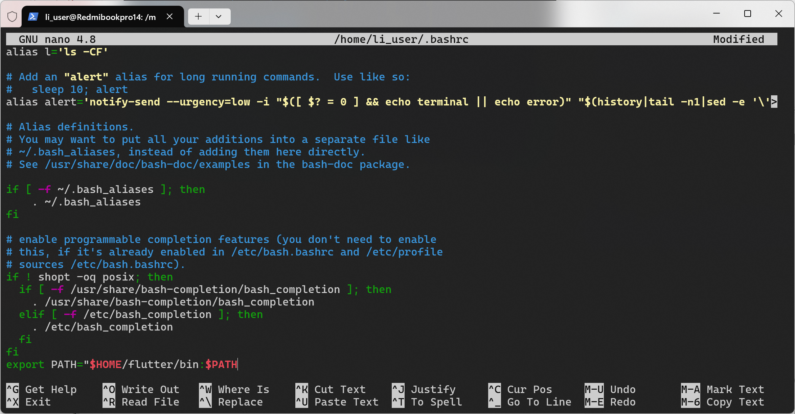

第三步点击ctrl + x保存退出，然后点击Y保存文件，然后点击回车退出。

第四步，使用指令让.bashrc文件立即生效:
```bash
source ~/.bashrc
```
以上四步非常重要，后续也会经常用到，并且后续会将以上步骤简写为下面这样，请注意识别:
```bash
nano ~/.bashrc
export PATH="/example/path/:$PATH" (paste)
source ~/.bashrc
```
注意这个(paste)不要也给复制进去了:smile:

查看flutter是否配置成功:
```bash
which flutter dart
```
若返回:
```
/home/example/flutter/bin/flutter
/home/example/flutter/bin/dart
```
注意，这个dart和flutter前面的目录必须完全一致。这样才算配置成功。
如果发现第二个目录和第一目录不一样，则运行`sudo -rm -rf /second/path/dart`以删除你之前可能单独安装过的dart。把/second/path/dart换成返回的第二个目录。
如果返回`No such file or directory`，那么请重新添加环境变量。

```bash
flutter --version
```
若返回如下版本信息:
```Flutter 3.19.6 • channel stable • https://github.com/flutter/flutter.git
Framework • revision 54e66469a9 (12 days ago) • 2024-04-17 13:08:03 -0700
Engine • revision c4cd48e186
Tools • Dart 3.3.4 • DevTools 2.31.1
```
则代表flutter工具箱安装成功。

预下载flutter开发二进制文件:
```bash
flutter precache
```

运行以下命令，查看环境缺失的项(本步操作只为查看缺失项):
```bash
flutter doctor
```
返回大致如下:
```
Doctor summary (to see all details, run flutter doctor -v):
[✓] Flutter (Channel stable, 3.19.6, on Ubuntu 20.04.6 LTS 5.15.146.1-microsoft-standard-WSL2, locale C.UTF-8)
[✗] Android toolchain - develop for Android devices
    ✗ Unable to locate Android SDK.
      Install Android Studio from: https://developer.android.com/studio/index.html
      On first launch it will assist you in installing the Android SDK components.
      (or visit https://flutter.dev/docs/get-started/install/linux#android-setup for detailed instructions).
      If the Android SDK has been installed to a custom location, please use
      `flutter config --android-sdk` to update to that location.

[✗] Chrome - develop for the web (Cannot find Chrome executable at google-chrome)
    ! Cannot find Chrome. Try setting CHROME_EXECUTABLE to a Chrome executable.
[✗] Linux toolchain - develop for Linux desktop
    ✗ clang++ is required for Linux development.
      It is likely available from your distribution (e.g.: apt install clang), or can be downloaded from
      https://releases.llvm.org/
    ✗ CMake is required for Linux development.
      It is likely available from your distribution (e.g.: apt install cmake), or can be downloaded from
      https://cmake.org/download/
    ✗ ninja is required for Linux development.
      It is likely available from your distribution (e.g.: apt install ninja-build), or can be downloaded from
      https://github.com/ninja-build/ninja/releases
    ✗ pkg-config is required for Linux development.
      It is likely available from your distribution (e.g.: apt install pkg-config), or can be downloaded from
      https://www.freedesktop.org/wiki/Software/pkg-config/
[!] Android Studio (not installed)
[✓] Connected device (1 available)
```
此时flutter安装完毕，我们需要完善`Android toolchain`，这个是flutter SDK运行的依赖项。

### 1.5 下载Android SDK并使用sdkmanager
打开官网: [Android Studio官网](https://developer.android.google.cn/studio)往下滑，找到这样的界面:
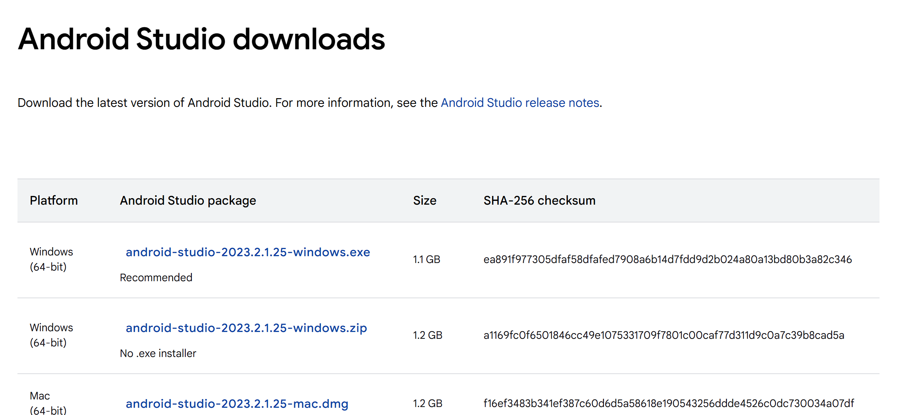
然后点击`Linux
(64-bit)	android-studio-2023.2.1.25-linux.tar.gz`版本下载。

打开Windows文件资源管理器，打开下载，复制刚才下载的文件:


按照如下路径粘贴:
`\wsl.localhost\Ubuntu-20.04\home\example\Packaging`
实际上就是从Windows系统下载，然后将文件拷贝到wsl虚拟机上，这就是wsl的好处，硬件不隔离。像这样:
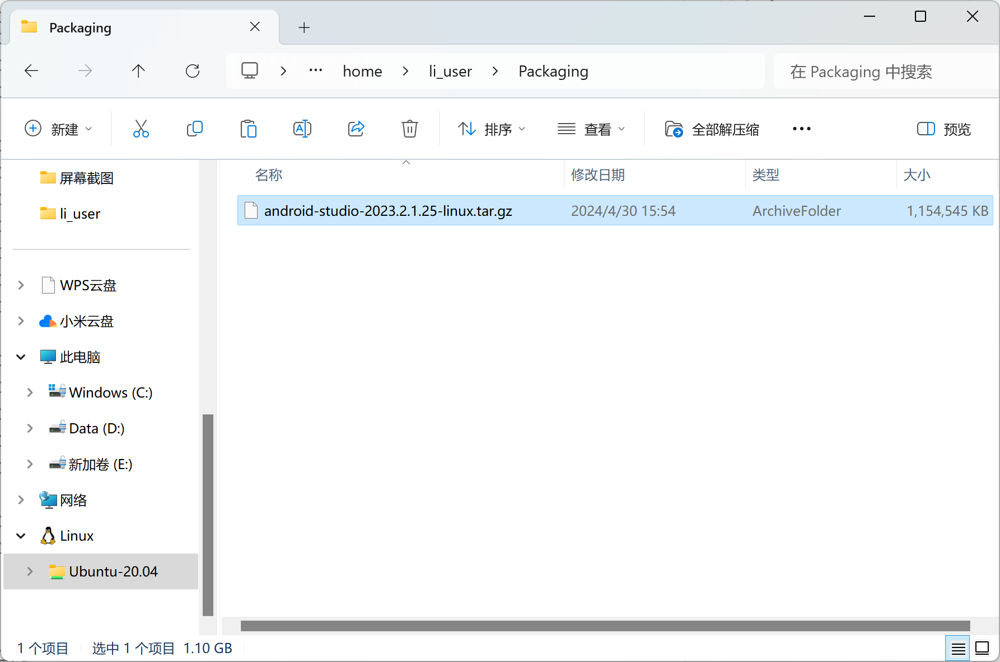

然后在终端使用命令解压:
```bash
tar -xzvf android-studio-2023.2.1.25-linux.tar.gz -C /$HOME/
```
输入第一条命令，系统会让你输入密码。输入之前你设置的密码就好。然后运行第二条命令的时候，需要把`android-studio-2023.2.1.25-linux.tar.gz`换成你下载的那个文件的文件名称。

将Android Studio可执行文件添加到环境变量:
```bash
nano ~/.bashrc
export PATH="/$HOME/android-studio/bin:$PATH"  (paste)
source ~/.bashrc
```

验证路径是否正确以及是否安装成功，分别运行下面两个命令，并查看返回:
```bash
which studio.sh
-> //home/li_user/android-studio/bin/studio.sh
studio.sh --version  
-> CompileCommand: exclude com/intellij/openapi/vfs/impl/FilePartNodeRoot.trieDescend bool exclude = true
Android Studio Iguana | 2023.2.1 Patch 2
Build #AI-232.10300.40.2321.11668458
```
**注意，如果在代码框中出现符号`->`，则代表这后面的东西是代码后运行的返回项，需要你去确认是否和我这边演示的一致。通常情况下是一致的，不过可能因为版本问题导致有些许不同，只需要保证基本一致就行。** 如果显示了路径，以及版本号，证明安装成功且环境变量配置成功。

运行Android Studio:
```bash
studio.sh
```

运行命令之后，将会打开Android Studio的图形化界面。

**注意，此时将准备通过Android Studio安装安卓SDK。你可能需要先打开网络代理。**

一直点击next，进入‘Android Studio Setup Wizard’，这会安装最新的 Android SDK， Android SDK Platform-Tools 以及 Android SDK Build-Tools，这些都是在开发 Android Flutter 应用时所需要的。

最后若出现:
```
Android SDK is up to date.
Creating Android virtual device
Android virtual device Pixel_3a_API_34_extension_level_7_x86_64 was successfully created
```
则代表Android Sdk安装成功，并且虚拟设备也安装成功。点击finish即可。

再次运行`flutter doctor`,返回如下:
```
Doctor summary (to see all details, run flutter doctor -v):
[✓] Flutter (Channel stable, 3.19.6, on Ubuntu 20.04.6 LTS 5.15.146.1-microsoft-standard-WSL2, locale C.UTF-8)
[!] Android toolchain - develop for Android devices (Android SDK version 34.0.0)
    ✗ cmdline-tools component is missing
      Run `path/to/sdkmanager --install "cmdline-tools;latest"`
      See https://developer.android.com/studio/command-line for more details.
    ✗ Android license status unknown.
      Run `flutter doctor --android-licenses` to accept the SDK licenses.
      See https://flutter.dev/docs/get-started/install/linux#android-setup for more details.
[✗] Chrome - develop for the web (Cannot find Chrome executable at google-chrome)
    ! Cannot find Chrome. Try setting CHROME_EXECUTABLE to a Chrome executable.
[✗] Linux toolchain - develop for Linux desktop
    ✗ clang++ is required for Linux development.
      It is likely available from your distribution (e.g.: apt install clang), or can be downloaded from
      https://releases.llvm.org/
    ✗ CMake is required for Linux development.
      It is likely available from your distribution (e.g.: apt install cmake), or can be downloaded from
      https://cmake.org/download/
    ✗ ninja is required for Linux development.
      It is likely available from your distribution (e.g.: apt install ninja-build), or can be downloaded from
      https://github.com/ninja-build/ninja/releases
    ✗ pkg-config is required for Linux development.
      It is likely available from your distribution (e.g.: apt install pkg-config), or can be downloaded from
      https://www.freedesktop.org/wiki/Software/pkg-config/
[✓] Android Studio (version 2023.2)
[✓] Connected device (1 available)
[!] Network resources
```
可以发现`Android toolchain`找不到`cmdline-tools`。所以我们要使用`sdkmanager`下载这个`cmdline-tools`。但是由于找不到存放`cmdline-tools`的路径，所以只能使用Android Studio图形化界面来下载`cmdline-tools`:
运行`studio.sh`打开Android Studio。
点击more action，然后选择SDK Manager，找到SDK Tools，勾选上NDK (Side by side)，以及Android SDK Command-line tools (latest)。然后就是重点的一步:
取消勾选`Obsolete`，然后将`tools`勾选，大概就像这样:
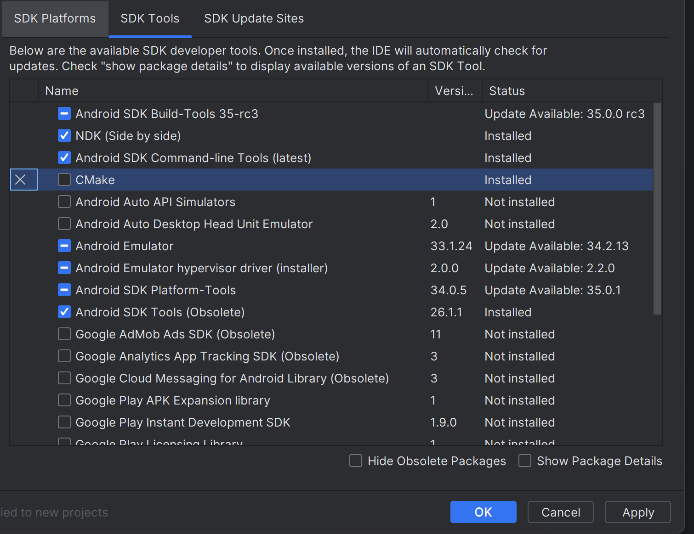
然后点击OK，等待下载完成即可。

运行以下命令，同意许可证:
```bash
flutter doctor --android-licenses
```
持续选择Y，然后回车。最后会提示你:
```
Accept? (y/N): y
All SDK package licenses accepted
```

最后，再次运行`flutter doctor`，查看安卓开发环境。返回应该如下:
```
Doctor summary (to see all details, run flutter doctor -v):
[✓] Flutter (Channel stable, 3.19.6, on Ubuntu 20.04.6 LTS 5.15.146.1-microsoft-standard-WSL2, locale C.UTF-8)
[✓] Android toolchain - develop for Android devices (Android SDK version 34.0.0)
[✗] Chrome - develop for the web (Cannot find Chrome executable at google-chrome)
    ! Cannot find Chrome. Try setting CHROME_EXECUTABLE to a Chrome executable.
[✗] Linux toolchain - develop for Linux desktop
    ✗ clang++ is required for Linux development.
      It is likely available from your distribution (e.g.: apt install clang), or can be downloaded from
      https://releases.llvm.org/
    ✗ CMake is required for Linux development.
      It is likely available from your distribution (e.g.: apt install cmake), or can be downloaded from
      https://cmake.org/download/
    ✗ ninja is required for Linux development.
      It is likely available from your distribution (e.g.: apt install ninja-build), or can be downloaded from
      https://github.com/ninja-build/ninja/releases
    ✗ pkg-config is required for Linux development.
      It is likely available from your distribution (e.g.: apt install pkg-config), or can be downloaded from
      https://www.freedesktop.org/wiki/Software/pkg-config/
[✓] Android Studio (version 2023.2)
[✓] Connected device (1 available)
```
我们重点关注`Android toolchain`。这个前面的框框必须完全打勾才可以。

**至此，flutter，Android SDK，NDK完全结束！:smile:**

### 1.6 安装Java工具箱

`JDK`是`sdkmanager`的依赖项，`sdkmanarger`依赖于jdk提供java的编译和运行环境。接下来，我们需要使用`sdkmanager`安装flet官方指定版本的`Android SDK`。

安装三方包安装管理器`Linux brew`:
```bash
sh -c "$(curl -fsSL https://raw.githubusercontent.com/Linuxbrew/install/master/install.sh)"
```
输入指令之后，系统会要求你输入管理员密码。输入完成之后，会让你再次回车确认，就像这样:
```
==> Checking for `sudo` access (which may request your password)...
[sudo] password for li_user: 

Press RETURN/ENTER to continue or any other key to abort:
```
**需要注意的是，下载过程中需要使用网络代理。**

安装完成之后，将会返回:
```
==> Next steps:
- Run these two commands in your terminal to add Homebrew to your PATH:
    (echo; echo 'eval "$(/home/linuxbrew/.linuxbrew/bin/brew shellenv)"') >> /home/li_user/.bashrc
    eval "$(/home/linuxbrew/.linuxbrew/bin/brew shellenv)"
- Install Homebrew's dependencies if you have sudo access:
    sudo apt-get install build-essential
  For more information, see:
    https://docs.brew.sh/Homebrew-on-Linux
- We recommend that you install GCC:
    brew install gcc
- Run brew help to get started
- Further documentation:
    https://docs.brew.sh
```
接下来我们将按照`Homebrew`提供的方法,完成以下几点:
- 添加到环境变量
- 安装`Homebrew`的依赖
- 安装gcc(可选)
- 查看使用文档以及帮助

我们将使用接下来的两个命令，将它添加到环境变量:
```bash
(echo; echo 'eval "$(/home/linuxbrew/.linuxbrew/bin/brew shellenv)"') >> /home/example/.bashrc
source ~/.bashrc
```
**注意，你需要将第一条命令中的example替换成你自己的用户名，或者执行返回给你的命令。** 本次添加环境变量不需要使用`nano`打开`.bashrc`文件去编辑，因为`echo`指令会帮你将它后面的字符串自动追加到`.bashrc`中。

接下来安装依赖项:
```bash
sudo apt-get update
sudo apt-get install build-essential
```
运行这个命令之后，将会安装`gcc`，`g++`，`make`等工具。这些工具可以用来编译`C`和`C++`。安装时除了会向你索要密码，还会向你确认是否安装，就像这样:
```
Do you want to continue? [Y/n] 
```
输入Y，点击回车即可。

接下来查看brew是否配置成功:
```bash
brew --version
-> Homebrew 4.2.20  # 这个是返回，不是需要执行的命令！
```
若像上面一样返回版本号，则配置成功。

接下来安装java:
```bash
brew install openjdk@17
```
flet官方提供的是`brew install --cask temurin8`这个安装命令，但是实际上这个安装命令只适用于MacOS。对于Linux，只能安装`temurin8`的替代，`openjdk17`。随后，等待安装完成。**如果下载失败，请使用代理，然后重新运行该命令。**
实际上应该用`openjdk@8`替代，但是我后来试了一下，这个版本太低了，所以改用`openjdk@17`。

之所以使用brew来安装，而不从temurin8官网下载包来安装是因为，使用brew安装可以自动处理依赖项，而手动安装经常会因为缺少依赖项而导致后期出现各种报错。所以本片教程将会尽量减少使用手动安装。

安装完成后，brew将会返回这段话:
```
==> openjdk@17
openjdk@17 is keg-only, which means it was not symlinked into /home/linuxbrew/.linuxbrew,
because this is an alternate version of another formula.

If you need to have openjdk@17 first in your PATH, run:
  echo 'export PATH="/home/linuxbrew/.linuxbrew/opt/openjdk@8/bin:$PATH"' >> ~/.profile

For compilers to find openjdk@17 you may need to set:
  export CPPFLAGS="-I/home/linuxbrew/.linuxbrew/opt/openjdk@17/include"
```
**下面你所运行的命令跟这段话有关！**

添加环境变量，运行下面这五行命令:
**运行命令前请先仔细阅读代码块下面一段说明！！！**
```bash
echo 'export PATH="/home/linuxbrew/.linuxbrew/opt/openjdk@17/bin:$PATH"' >> ~/.bashrc
echo 'export CPPFLAGS="-I/home/linuxbrew/.linuxbrew/opt/openjdk@17/include"' >> ~/.bashrc
echo 'export JAVA_HOME="/home/linuxbrew/.linuxbrew/Cellar/openjdk@17/17.0.11"' >> ~/.bashrc
echo 'export PATH="$JAVA_HOME/bin:$PATH"' >> ~/.bashrc
source ~/.bashrc
```
我们现在在做的是添加环境变量。由于brew版本可能不同，所以你运行的指令和上面的可能有些许不同。不过都是为了满足如下三个目的:

- 让编译器能够找到openjdk@17
- 让系统能够找到java
- java执行的时候能够找到它所需要的文件

所以，对于第一个目的，你只需要将brew返还给你的命令添加到`.bashrc`文件中就可以了，你只需要将前两个命令中的`echo`之后的东西改为brew返还给你的命令就行了，也就是`export...`。需要注意的是，**需要把这个命令用单引号括起来。** 对于后两个命令，你需要打开Windows文件资源管理器，然后找到java可执行文件。就像这样:
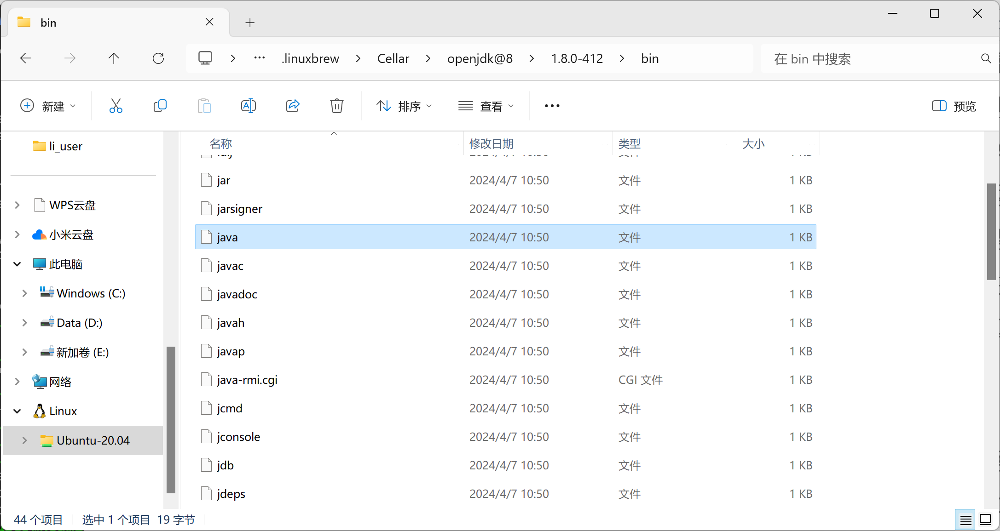
然后将第三个指令，也就是`JAVA_HOME`的换成`bin`之前的那个目录。比如说，在我这里，这个目录最终是`/home/linuxbrew/.linuxbrew/Cellar/openjdk@17/17.0.11`。实际上你要把这个目录替换成java的根目录。最后一条指令原封不动执行就好。

最终，我们运行以下，看看java是否配置成功:
```bash
java -version  # 注意这里的version前面只有一个短横线
-> openjdk version "1.8.0_412"
OpenJDK Runtime Environment (build 1.8.0_412-linuxbre_2024_04_17_05_43-b00)
OpenJDK 64-Bit Server VM (build 25.412-b00, mixed mode)
```
如果你的返回跟我的差不多，那么意味着你的java安装配置成功了！

接下来，我们要指定一下我们要求的Android SDK和NDK版本:
```bash
echo 'export ANDROID_SDK_ROOT="$HOME/Android/Sdk"' >> ~/.bashrc
echo 'export NDK_VERSION=25.2.9519653' >> ~/.bashrc 
echo 'export SDK_VERSION=android-33' >> ~/.bashrc
```

接下来需要将`sdkmanager`路径添加到环境变量中，首先你需要找到sdkmanager所在的路径:
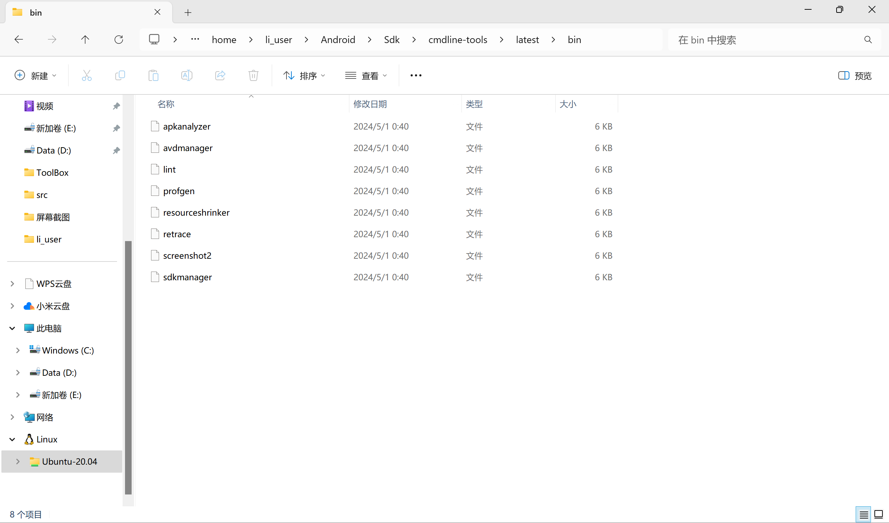
比如说，我的`sdkmanager`在这个目录下: `$HOME/Android/sdk/cmdline-tools/latest/bin`，那么我的命令就是这样的:
```bash
echo 'export PATH="$ANDROID_SDK_ROOT/cmdline-tools/latest/bin:$PATH"' >> ~/.bashrc
```

设置`ANDROID_SDK_TOOLS`:
```bash
echo 'export ANDROID_SDK_TOOLS="$HOME/Android/Sdk/cmdline-tools/bin"' >> ~/.bashrc
```

最后刷新读取一下`.bashrc`文件:
```bash
source ~/.bashrc
```

确认以下`sdkmanager`是否正确配置:
```bash
sdkmanager --version
-> 13.0
```
如果返回版本信息，则配置成功。

接下来将会使用`sdkmanager`安装指定版本的SDK和NDK，运行下面两个命令:
```bash
sdkmanager --install "ndk;$NDK_VERSION" --channel=3
sdkmanager --install "platforms;$SDK_VERSION"
```
安装完成后应该时分别显示:
```
Warning: Errors during XML parse:
Warning: Additionally, the fallback loader failed to parse the XML.
[=======================================] 100% Unzipping... android-ndk-r25c/sha

Warning: Errors during XML parse:
Warning: Additionally, the fallback loader failed to parse the XML.
[=======================================] 100% Unzipping... android-13/framework
```
此时，遇到了警告: XML文件无法解析。然后抛出了一个失败: 解析XML文件失败。如果你也出现这个问题，不要紧张，这个警告目前没有导致错误。SDK和NDK被成功解压，安装成功。

**截至目前为止，java工具箱以及flet官方需要的sdk以及nkd都被安装成功！:smile:**


### 2.1 配置Python环境
进入[python官网下载界面](https://www.python.org/downloads/)，下载python3.11.6。大概像这个样子:
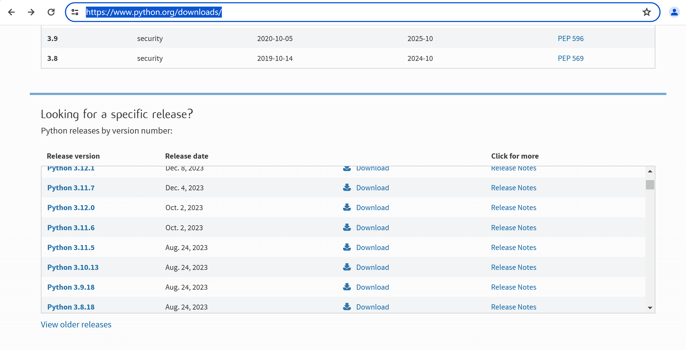
点进去之后往下滑，找到下载链接:

下载第一个就好了，但是如果你有特殊需要可以下载别的版本。
如果你不想自己去官网找，那么也可以直接点击这个链接下载: [Python 3.11.6 下载](https://www.python.org/ftp/python/3.11.6/Python-3.11.6.tgz)

下载完成后，将它拷贝到工作目录，也就是`/$HOME/Packaging/`。像这个样子:
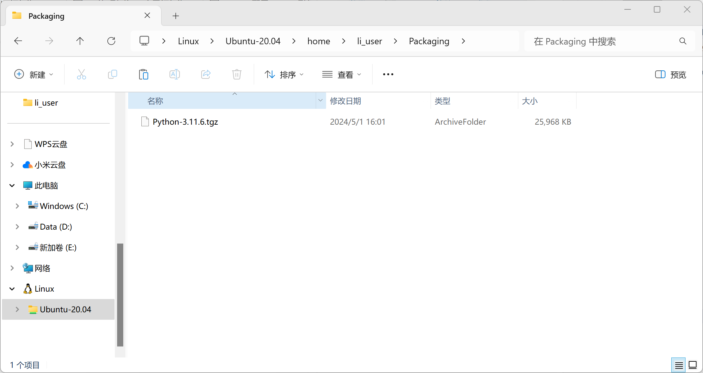

然后使用命令解压:
```bash
tar -xzvf Python-3.11.6.tgz -C /$HOME
```
这个命令将会把下载的python源代码解压到家目录。

接下来我们要开始编译和安装python。
首先安装python安装所需要的所有依赖库:
```bash
sudo apt update  
sudo apt install libffi-dev libssl-dev libsqlite3-dev zlib1g-dev libbz2-dev libreadline-dev libncurses5-dev libgdbm-dev liblzma-dev tk-dev uuid-dev lld
```

然后导航到python解压后的目录:
```bash
cd /$HOME/Python-3.11.6
```
然后运行配置文件并编译，运行下面两个命令:
```bash
./configure
sudo make
```
这可能会花费一些时间...

最后运行:
```bash
sudo make install
```
完成安装。

**注意！**
以上步骤安装python可能会失败，所以每一步完成之后，都往上滑动翻找一下是否存在错误。如果存在错误，直接将报错内容复制给AI，然后进行配置。大概率出现的问题都会囊括在前言中提到的‘可能产生的问题’当中。

解决完问题后需要重新运行配置文件，然后重新编译和安装，你需要先清理原先编译的内容，运行下面的四个命令:
```bash
sudo make clean
./configure
sudo make  
sudo make install
```

将python3.11.6添加到环境变量:
```bash
echo 'export PATH="/usr/local/bin:$PATH"' >> ~/.bashrc
source ~/.bashrc
```

接下来我们测试一下python是否正确配置:
```bash
python3 --version
-> Python 3.11.6
```
如果返回值为3.11.6，那么你的python环境配置成功了。

接下来我们需要去创建一个python的虚拟隔离环境。

首先导航到我们用于打包的工作目录:
```bash
cd /$HOME/Packaging
```
然后创建`venv`虚拟环境:
```bash
python3 -m venv .venv
```
这里，我们创建了一个venv环境，环境存放在`/$HOME/Packaging`中。

然后我们需要去激活这个虚拟环境。激活虚拟环境之后，我们运行python的解释器，或者pip工具就都是用的虚拟环境中的工具了。激活指令:
```bash
source .venv/bin/activate
```
然后，你的命令行就会变成这个样子:
```
(.venv) example@Redmibookpro14://home/example/Packaging$
```
前面会多出来个`.venv`，代表激活成功。如果没有出现，那么可以尝试这个命令`source .venv/bin/activate.ps1`。

**至此，python环境安装结束:smile:**


### 2.2 安装p4a

p4a是Python for Android的简称，它可以创建python的安卓发行版。接下来我们要安装p4a以及它的依赖项。

首先升级pip工具，并升级所有库:
```bash
pip3 install --upgrade pip
sudo apt-get upgrade
```

安装p4a:
```bash
pip3 install git+https://github.com/flet-dev/python-for-android.git@3.11.6
```
**这里需要使用网络代理！！！**

然后安装cython:
```bash
pip3 install --upgrade cython
```
**这里需要使用网络代理！！！**

安装p4a依赖:
```bash
sudo apt-get install autoconf automake libtool
```

接下来我们要使用p4a创建python的安卓发行版:
```bash
p4a create --requirements numpy,opencv --arch arm64-v8a --arch armeabi-v7a --arch x86_64 --sdk-dir $ANDROID_SDK_ROOT --ndk-dir $ANDROID_SDK_ROOT/ndk/$NDK_VERSION --dist-name mydist
```
**注意！** 
这个命令中--requirements这个选项之后，你需要加入你的程序的直接依赖项。例如，你在你的flet程序中使用了numpy，那么你就把numpy添加在这里。不同的包之间需要用逗号隔开。目前支持的三方包在[这里](https://github.com/kivy/python-for-android/tree/develop/pythonforandroid/recipes)可以查看。它包含了大多数的常用三方包，例如`numpy`和`opencv`。不过需要注意的是，这里填写的包名可能和你之前pip下载时候的包名不一样。例如，之前pip下载`opencv`时，我用的是`pip install opencv-python`，但是在这里，你只需要输入`opencv`，而不能输`opencv-python`。

上面的命令是最容易报错的一步，你添加的包越多，越容易报错，因为你所需的依赖就越多。

如果上面的命令运行报错，那么你需要将报错复制给AI，然后按照AI提供的解决办法去做，然后运行`p4a clean_builds`之后再重新运行上面的命令。

**你是不是绝望了:smile:？**
修复了一个又一个问题，但是发现还是报错？
让我猜猜...
`cmake`，`clang`，`android-sdk`，`jdk`，`gcc`
各种各样的问题对吧？
但实际上归根结底就是那么几个[问题](#前言)。有一种情况很难发现，就是某个编译器，例如`cmake`，可能存在多个。但是构建的时候，你必须要指定一个版本适合的`cmake`。这个时候你需要通过调整环境变量的顺序来实现。软件在查找的时候，是按照`PATH`中的路径依次查找需要的可执行文件，所以谁先被找到，谁就会被用。有些报错原因是因为版本对不上，那么你就需要去官网下载Linux安装包，然后解压到指定目录，然后再配置环境变量，实际上万变不离其宗。你可能会卡在这里几个小时，甚至几天。

**再试试没准就成了！:yum::yum::yum:**

如果，运行完成之后出现这个:
```
[INFO]:    <- directory context /home/example/Packaging
[INFO]:    # Your distribution was created successfully, exiting.
[INFO]:    Dist can be found at (for now) /home/example/.local/share/python-for-android/dists/mydist
```
那么恭喜！！！最难的一步完成了！

**至此p4a完成配置:yum::smile:**

### 3.1开始打包apk！

首先，将你的项目文件夹放到`Packaging`目录下:
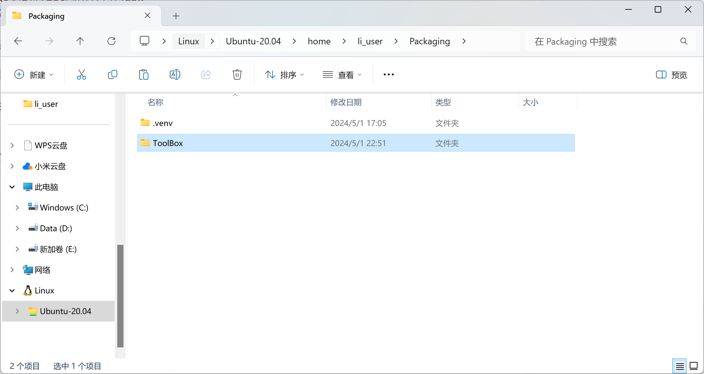
然后导航到你的项目中:
```bash
cd ./Your_project
```
需要注意的是，你的项目结构必须像这样:
- your project
  - /assets/
        - icon.png
        - main.py
        - requirements.txt
        - other files

具体查看官方的[文档](https://flet.dev/docs/publish)。

安装`flet`并升级保证最新:
```bash
pip3 install flet
pip install --upgrade flet
```
需要注意的是，你需要激活你的虚拟环境。如果你之前有退出过虚拟环境或者运行过`source ~/.bashrc`那么需要重新激活虚拟环境。你可以通过查看命令行之前有没有`(.venv)`来判断是否激活。

安装依赖库:
```bash
sudo apt update 
sudo apt install libgtk-3-dev gstreamer1.0-plugins-base gstreamer1.0-plugins-good gstreamer1.0-plugins-bad gstreamer1.0-plugins-ugly gstreamer1.0-libav gstreamer1.0-tools gstreamer1.0-doc gstreamer1.0-x gstreamer1.0-alsa gstreamer1.0-gl gstreamer1.0-gtk3 gstreamer1.0-qt5 gstreamer1.0-pulseaudio mpv
```

然后，设置环境变量并打包:
```bash
export SERIOUS_PYTHON_P4A_DIST=$HOME/.local/share/python-for-android/dists/mydist
```
**注意！**
后面这个路径得是`p4a create`命令返还给你的路径。具体请看[安装p4a](从0到1将flet打包为apk.md)末尾。

输入:
```bash
flet build -h
```
查看flet是否安装成功。

其返回为参数介绍:
```
usage: flet build [-h] [-v] [-o OUTPUT_DIR] [--project PROJECT_NAME] [--description DESCRIPTION] [--product PRODUCT_NAME]
                  [--org ORG_NAME] [--company COMPANY_NAME] [--copyright COPYRIGHT]
                  [--android-adaptive-icon-background ANDROID_ADAPTIVE_ICON_BACKGROUND] [--splash-color SPLASH_COLOR]
                  [--splash-dark-color SPLASH_DARK_COLOR] [--no-web-splash] [--no-ios-splash] [--no-android-splash]
                  [--team TEAM_ID] [--base-url BASE_URL] [--web-renderer {canvaskit,html}] [--use-color-emoji]
                  [--route-url-strategy {path,hash}] [--flutter-build-args [FLUTTER_BUILD_ARGS ...]]
                  [--include-packages FLUTTER_PACKAGES [FLUTTER_PACKAGES ...]] [--build-number BUILD_NUMBER]
                  [--build-version BUILD_VERSION] [--module-name MODULE_NAME] [--template TEMPLATE]
                  [--template-dir TEMPLATE_DIR] [--template-ref TEMPLATE_REF]
                  {macos,linux,windows,web,apk,aab,ipa} [python_app_path]

Build an executable app or install bundle.

positional arguments:
  {macos,linux,windows,web,apk,aab,ipa}
                        the type of a package or target platform to build
  python_app_path       path to a directory with a Python program

options:
  -h, --help            show this help message and exit
  -v, --verbose         -v for detailed output and -vv for more detailed
  -o OUTPUT_DIR, --output OUTPUT_DIR
                        where to put resulting executable or bundle (default is
                        <python_app_directory>/build/<target_platform>)
  --project PROJECT_NAME
                        project name for executable or bundle
  --description DESCRIPTION
                        the description to use for executable or bundle
  --product PRODUCT_NAME
                        project display name that is shown in window titles and about app dialogs
  --org ORG_NAME        org name in reverse domain name notation, e.g. "com.mycompany" - combined with project name and
                        used as an iOS and Android bundle ID
  --company COMPANY_NAME
                        company name to display in about app dialogs
  --copyright COPYRIGHT
                        copyright text to display in about app dialogs
  --android-adaptive-icon-background ANDROID_ADAPTIVE_ICON_BACKGROUND
                        the color which will be used to fill out the background of the adaptive icon
  --splash-color SPLASH_COLOR
                        background color of app splash screen on iOS, Android and web
  --splash-dark-color SPLASH_DARK_COLOR
                        background color in dark mode of app splash screen on iOS, Android and web
  --no-web-splash       disable web app splash screen
  --no-ios-splash       disable iOS app splash screen
  --no-android-splash   disable Android app splash screen
  --team TEAM_ID        Team ID to sign iOS bundle (ipa only)
  --base-url BASE_URL   base URL for the app (web only)
  --web-renderer {canvaskit,html}
                        renderer to use (web only)
  --use-color-emoji     enables color emojis with CanvasKit renderer (web only)
  --route-url-strategy {path,hash}
                        URL routing strategy (web only)
  --flutter-build-args [FLUTTER_BUILD_ARGS ...]
                        additional arguments for flutter build command
  --include-packages FLUTTER_PACKAGES [FLUTTER_PACKAGES ...]
                        include extra Flutter Flet packages, such as flet_video, flet_audio, etc.
  --build-number BUILD_NUMBER
                        build number - an identifier used as an internal version number
  --build-version BUILD_VERSION
                        build version - a "x.y.z" string used as the version number shown to users
  --module-name MODULE_NAME
                        python module name with an app entry point
  --template TEMPLATE   a directory containing Flutter bootstrap template, or a URL to a git repository template
  --template-dir TEMPLATE_DIR
                        relative path to a Flutter bootstrap template in a repository
  --template-ref TEMPLATE_REF
                        the branch, tag or commit ID to checkout after cloning the repository with Flutter bootstrap
                        template
```
详细介绍请看[官方文档](https://flet.dev/docs/publish)。

**请打开网络代理！！！**
这里，我们只使用最基本的打包，然后指定一个版本号，并显示打包进度:
```bash
flet build apk --build-version "1.1.1" -vv
```
复制...
粘贴...
紧张的最终时刻！！！

然后激动的发现报错。。。:
```
[notice] A new release of pip is available: 23.2.1 -> 24.0
[notice] To update, run: /tmp/hostpython3.11_FTIFGU/python/bin/python3 -m pip install --upgrade pip
Deleting Flutter bootstrap directory /tmp/flet_flutter_build_HxOVaJSSBF
Error building Flet app - see the log of failed command above.
```
完整的报错提示显示说是一个pip问题，那么我们更新pip试试:
```bash
/tmp/hostpython3.11_FTIFGU/python/bin/python3 -m pip install --upgrade pip
```
我们跑一下它提供的命令。

安装成功:
```
Installing collected packages: pip
  Attempting uninstall: pip
    Found existing installation: pip 23.2.1
    Uninstalling pip-23.2.1:
      Successfully uninstalled pip-23.2.1
Successfully installed pip-24.0
```

那么，我们再次运行打包指令！
激动...
紧张...

**终于打包完成了！**
```
[ +482 ms] ✓  Built build/app/outputs/flutter-apk/app-release.apk (54.7MB).
[        ] "flutter apk" took 332,008ms.
[ +196 ms] ensureAnalyticsSent: 194ms
[        ] Running 0 shutdown hooks
[        ] Shutdown hooks complete
[   +1 ms] exiting with code 0
OK
Copying build to build/apk directory...Copying build output from: /tmp/flet_flutter_build_lhm93KZXpo/build/app/outputs/flutter-apk/*
OK
Deleting Flutter bootstrap directory /tmp/flet_flutter_build_lhm93KZXpo
Success!
```

### 3.2 找到apk并在手机上测试

打开文件资源管理器，然后进入如下目录:
```$HOME/Your_porject/build/apk```
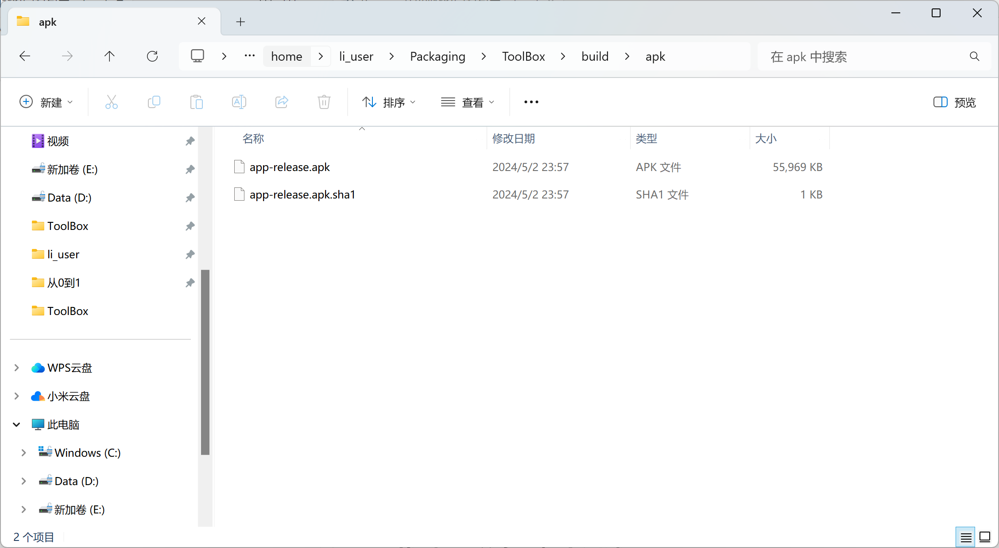

然后将apk文件拷贝，通过数据线传到手机上或者通过任何方法传到手机上安装！如果说，你的apk安装后无法正常使用，那么就放弃吧，直接等几周。根据flet开发者在2024年5月1日发表的一篇博客，packaging 2.0将会在这几周内发布。

***Packaging 2.0***
In the next iteration of Flet's packaging implementation, we are going to move away from Kivy and replace it with Mobile Forge. Mobile Forge has been created by Beeware team based and their experience with Briefcase and Chaquopy. Mobile Forge is a clean-room implementation of a packaging tool for binary Python packages which is relies on crossenv.

The main promise of Mobile Forge with crossenv is that most existing non-pure Python packages will be able to compile for iOS and/or Android by simply adding a recipe with meta.yaml file only, without requiring any hacks or patches.

We are going to use Mobile Forge to pre-build the most popular non-pure Python packages for iOS and Android and host them in our own public repository. You will be able to use that tool to build and contribute other packages, non present in our repository.

We've created a new "Packages" category in Flet discussions where you can post, vote and discuss requests for non-pure (native) Python packages that work with Flet (check rules before posting there). Flet's goal is to provide the most comprehensive catalog of pre-built Python packages and make the process of adding new packages as friendly and transparent as possible.

The new version of flet build will use a custom-made virtual pip index. This index will analyze dependencies, detect non-pure packages, and offer to pip mobile packages. For all other packages, it will fall back to PyPI.

The new packaging will be hopefully available in a few weeks. While we are working we encourage you to visit Packages and see if the package you need is there. Submitting a request or voting for existing package will help us to prioritize package "recipes".

大致意思就是，这几周之内就会发布打包2.0，这时，就会彻底放弃p4a，也就是说，对于python的非纯python语言三方库，例如numpy或者opencv，就会使用Mobile Forge的recipe将这个包编译为Android可用的。总之就是，如果你现在打包不成功，等几周，然后再去官网看就行了。


